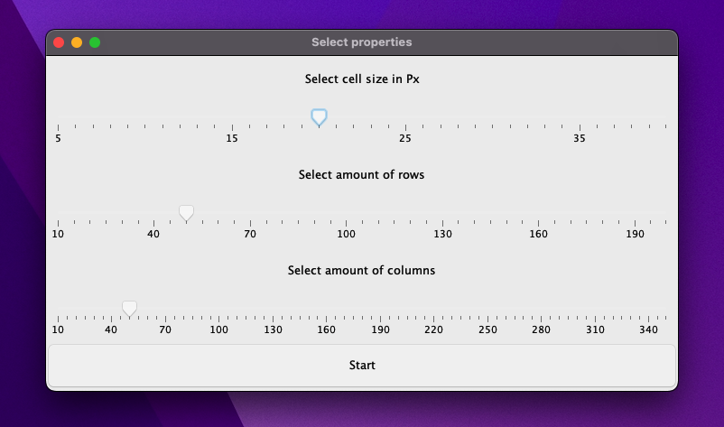
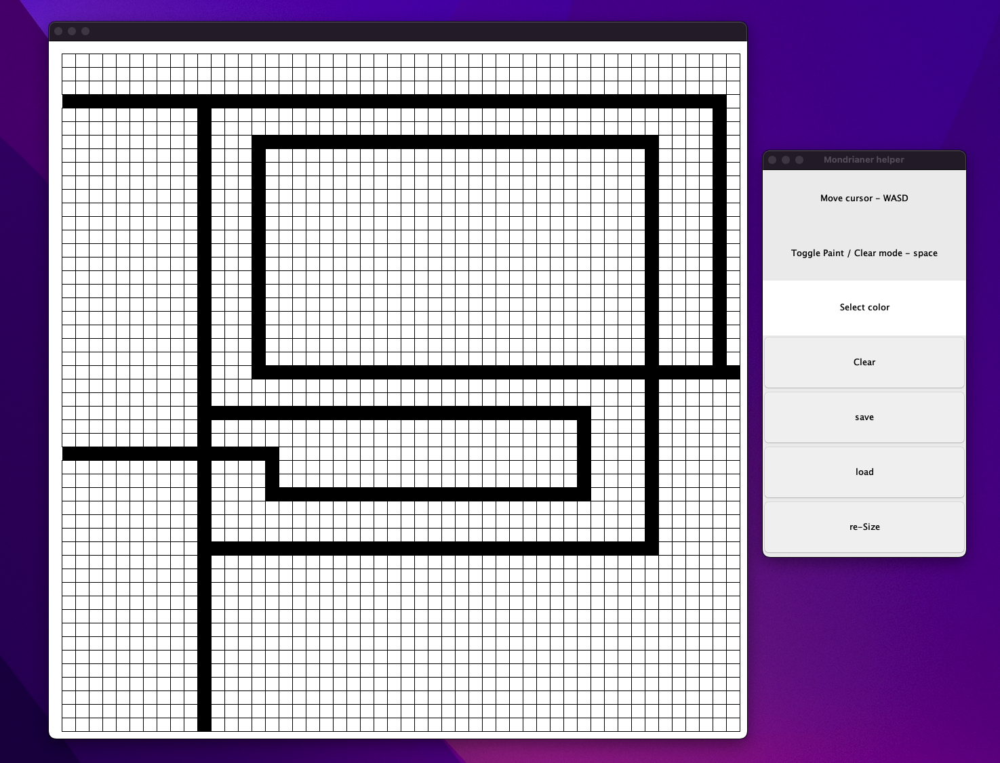
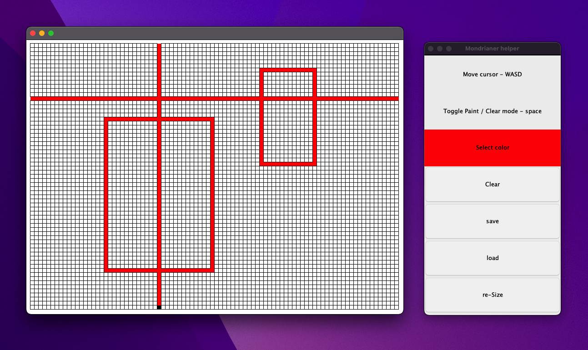

#    Mondrianer

> Desktop 2D drawing application intentend to created "pixeleted" art. Inspired by the works of Dutsh painter [Piet Mondrian](https://pt.wikipedia.org/wiki/Piet_Mondrian).

> Demo  ==>  Given the app is still in develpment I haven't yet compiled it, can be run thru a JDK compatible IDE see [Setup](#setup) for more info.

## Table of Contents
* [Screenshots](#screenshots)
* [General Info](#general-information)
* [Technologies Used](#technologies-used)
* [Setup](#setup)
* [Project Status](#project-status)
* [Features](#features)
* [Room for Improvement](#room-for-improvement)
* [Acknowledgements](#acknowledgements)
* [Contact me](#contact-me)

## Screenshots
<picture>

</picture>

<picture>

</picture>

<picture>

</picture>

## General Information
2D drawing desktop application implemented in Java, intended to create "pixelated" style art with a user difined canvas size and resolution.

## Technologies Used
- Java
- SimpleGraphics Library

## Setup
[Download here](https://github.com/JohnLacerdaOliveira/Modrianer) the intire repo and open it with IntellJ or any other JDK IDE and compile and run the project from there.

## Project Status
Current status is one of an alpha phase corresponding to a proof of concept, I'll consider it as a minimum viable product once features regardind v1.0 discribed [here](#room-for-improvement) are implemented. 

## Features
- Dynamically generated canvas size and resolution defined thru a start-up prompt
- Save and load features that store the image as .txt file allowing to save work in between sessions.

## Room for Improvement
v1.0
- Remove SimplyGraphics dependency and implement all graphical functionality thru Java .awt and swing libraries
- Ability to change the color using the colorChooser panel
- Ability to remove the grid
- Ability to print screen the canvas and export it as .jpeg file

## Acknowledgements
To [Pedro Vieira](https://www.linkedin.com/in/thepedrov/) for the inspiration behind the idea

## Contact me

